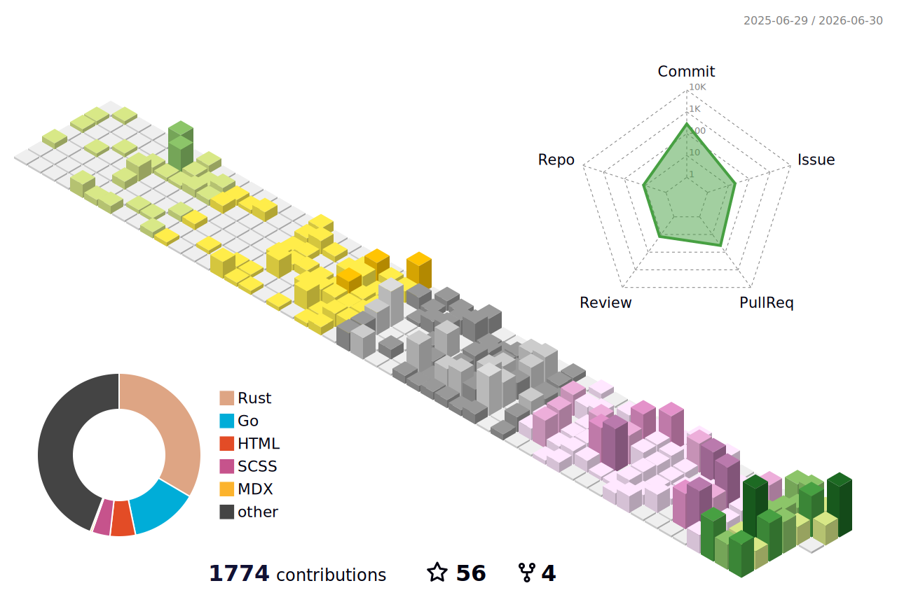

  
   
  

---

## About Me

Hi there! I'm **Lingbou**, a developer who enjoys Linux, backend engineering,
open source, and cloud native infrastructure.

- 就读于 SYUCT
- 关注 Linux、软件开发、开源和云计算
- 持续学习新技术，并把想法落到实际项目里

## GitHub Activity

  <picture>
    <source media="(prefers-color-scheme: dark)" srcset="./profile-3d-contrib/profile-night-rainbow.svg">
    <source media="(prefers-color-scheme: light)" srcset="./profile-3d-contrib/profile-season-animate.svg">
    
  </picture>
   
  

## Tech Stack

### Languages

### Frameworks & Tools

### Databases & Cloud

## Focus

  
  

| Area | Tools I like |
| --- | --- |
| Backend | Spring Boot, Gin, FastAPI |
| Infrastructure | Linux, Docker, Kubernetes, Nginx |
| Data & Messaging | MySQL, PostgreSQL, Redis, Kafka, RabbitMQ |
| Engineering | Git, Maven, Jenkins, open source workflows |

---
